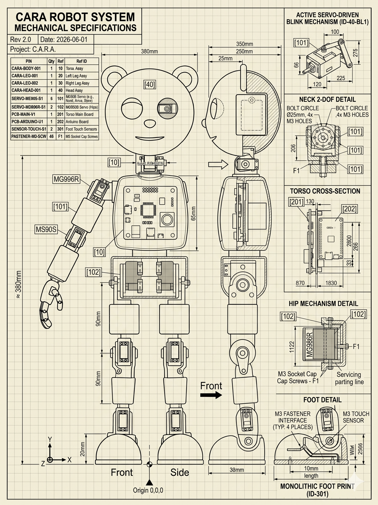

# 🐻 Project Cara

**An embodied, emotionally adaptive companion robot.**
A 20-DoF articulated teddy bear that learns to see, walk, and care.

> *Author: Elida Sensoy*
> *Platform: NVIDIA Jetson Orin Nano Super + Arduino Nano | ROS 2 Humble | Docker*
> *Core Stack: MuJoCo (physics + sim-to-real model) • TensorRT • ViT-based Emotion Recognition • Reinforcement Learning • Gemini LLM*

> **Simulation note.** Locomotion was originally scoped for NVIDIA Isaac Lab
> (the `isaac/` folder holds that earlier RL-environment exploration). The
> active path is **MuJoCo**: a single parameterised robot description
> (`cara_description/`) that generates both URDF and MJCF, built and validated
> in stages — kinematics, then dynamics, then per-limb dynamic checks — before
> any policy training. Isaac Lab remains an option for large-scale parallel RL
> once the model is trusted.

---

## Table of Contents

1. [What Cara Is](#what-cara-is)
2. [Design Philosophy](#design-philosophy)
3. [System Architecture](#system-architecture)
4. [Embodied Motion & Control](#embodied-motion--control)
5. [Personalized Emotion Recognition](#personalized-emotion-recognition)
6. [Toward Understanding: Homeostatic Agency](#toward-understanding-homeostatic-agency)
7. [Hardware](#hardware)
8. [Software Stack & Repo Structure](#software-stack--repo-structure)
9. [Quick Start](#quick-start)
10. [Safety](#safety)
11. [Further Reading](#further-reading)

---

## What Cara Is

Cara is an embodied AI companion designed to **sense, interpret, and respond to human emotion** while moving through the world as a physical agent. She is built around three intertwined ideas:

- **A body** : a 20-DoF humanoid teddy bear skeleton, trained to walk in simulation and deployed to real hardware.
- **A face for the world** : a personalized Vision Transformer that learns *your* expressions, not a generic dataset's.
- **A self** : a homeostatic control loop where motion, emotion, and memory are modulated by Cara's own internal "vitals."

She is intended as a warm, interactive companion, particularly for people facing chronic illness, disability, or isolation.

---

## Design Philosophy

Most AI systems treat perception, emotion, and motion as separate subsystems glued together with rules. Cara is built on the opposite assumption: **understanding is downstream of agency**.

```
Perception -> Internal State -> Motion Policy -> Body -> Feedback
```

 
https://github.com/user-attachments/assets/e023d652-621f-4e27-8c53-0dc29c00cf4d

*media/videos/cara_walk_mesh.webm*

Emotion and memory influence *how* motion is generated, by **shaping the constraints and targets of the controller**.

 
Three principles shape every layer:

1. **Emotion is a control signal, not a label.** Detected affect modifies posture, gait tempo, and stiffness : it never overrides safety constraints.
2. **One brain, two worlds.** The same RL policy runs in simulation (MuJoCo) and on the Jetson. No hand-coded gaits, no animation layers.
3. **Self-maintenance is primary.** Cara has internal "vitals" (thermal margin, actuator health, sensor confidence). When they degrade, behavior adapts : even at the cost of the current task.

---

## System Architecture

Cara follows a **Sense -> Think -> Act** pipeline inspired by Disney Research's articulated character control (e.g., *Olaf*), implemented across ROS 2 nodes that mirror the structure used in simulation.

```
       ┌──────────────────────────────────────────┐
       │                                          │
       │              ENVIRONMENT                 │
       │                                          │
       └──────────┬───────────────────────────────┘
                  │
                  ▼
          ┌─────────────────┐
          │  PHYSICAL CARA  │ ← servos, battery, IMU, Jetson
          └────────┬────────┘
                   │ raw signals
                   ▼
          ┌─────────────────┐
          │   TELEMETRY     │ ← Arduino + INA219 + IMU
          │   AGGREGATION   │   (3 time scales: 50/10/1 Hz)
          └────────┬────────┘
                   │ /cara/power/* /diagnostics
                   ▼
          ┌─────────────────┐
          │  FAULT FUSION   │ ← health_node
          │  + SELF-STATE   │   confirms stalls, computes
          │     ESTIMATE    │   wellness W(t)
          └────────┬────────┘
                   │ S(t), W(t)
                   ▼
          ┌─────────────────┐
          │     POLICY      │ ← arbiter
          │    ARBITER      │   constrains action space
          │                 │   based on wellness
          └────────┬────────┘
                   │ action commands
                   ▼
          ┌─────────────────┐
          │     ACTUATORS   │ → back to physical Cara
          └─────────────────┘
                   │
                   └─── loop closes ───┘
```
#### A Loop Closure Example Scenario

To visualize, here is an example of the entire sequence happens which happens in one second, the feedback loop. The robot sees a problem, reasons about it using fused multi-sensor data, changes its own behavior to recover, and then restored full capability when conditions allowed.

```
t=0.00s   Cara is walking. Right hip servo stalls against an obstacle.
t=0.02s   Arduino fast layer detects: joint commanded to 60°, applied 58°,
          held for >100ms. Publishes EVT,suspect_stall,r_hip.
t=0.05s   INA219 medium layer reads servo rail current: 2.4A
          (baseline was 800mA). Publishes /cara/power/servo/current_ma.
t=0.05s   IMU reports body orientation unchanged for 200ms.
          Publishes /cara/imu/orientation.
t=0.10s   health_node receives all three signals. Fault fusion logic
          fires: suspect_stall ∧ current_spike ∧ imu_motionless = CONFIRMED.
t=0.11s   health_node updates: A = 0.4 (actuator health degraded),
          W = 0.55 (wellness moderately degraded).
t=0.12s   Policy arbiter at next cycle sees W < 0.6. Drops from "full
          action space" to "homeostatic actions only." Selects: REST.
t=0.13s   Action: stop walking, return to neutral pose.
t=0.14s   Servo command goes out via PCA9685 to put leg in safe position.
t=0.20s   Stall current drops to baseline. INA219 confirms.
t=0.21s   No suspect_stall events for >500ms. health_node clears the
          confirmed fault but logs it. W recovers to 0.85.
t=0.30s   Policy arbiter sees W > 0.8. Restores reduced action space
          (no walking, gestures allowed).
t=1.00s   No further faults. W > 0.9. Full action space restored.
          Cara can attempt the walk again — but with the stall event
          logged in episode memory, so future policy updates will
          learn from it.
```
---
## Core ROS 2 Nodes

| Node                   | Package                  | Role                                                            |
| ---------------------- | ------------------------ | --------------------------------------------------------------- |
| `imu_node`             | `cara_motion_control`    | Reads fused orientation from BNO055 IMU                         |
| `emotion_node`         | `cara_vision_control`    | ViT-based personalized emotion inference + on-device fine-tune  |
| `face_yunet_node`      | `cara_vision_control`    | YuNet face detector — crops face, publishes center point        |
| `model_gaze_mapper`    | `cara_gaze_control`      | Maps face position → `/head_cmd` for neck pan/tilt tracking     |
| `servo_pca9685_node`   | `cara_vision_control`    | Drives neck servos via PCA9685 I²C from `/head_cmd`             |
| `behavior_node`        | `cara_vision_control`    | Translates emotion + mind-mode → blink rate commands            |
| `arduino_bridge_node`  | `cara_vision_control`    | Forwards blink commands to Arduino over serial                  |
| `policy_node`          | `cara_motion_control`    | Runs the trained RL locomotion policy (ONNX)                    |
| `actuator_node`        | `cara_motion_control`    | Drives 20 servos via dual PCA9685 boards                        |
| `health_node`          | `cara_health`            | Publishes distress signals (thermal, battery, actuator load)    |
| `cara_control_node`    | `cara_control`           | Servo-rail health → policy observation → controller signal path (C++, observation-only). See [Actuator-Health Signal Path](#actuator-health-signal-path). |

All nodes communicate via standard ROS 2 messages and a `ROS_DOMAIN_ID=7` environment, enabling seamless sim-to-real transfer.


### Runtime Pipeline

Cara's runtime splits into three parallel pipelines that share the same sensor inputs but own separate outputs:

```
┌─────────────────────────────────────────────────────────────────────┐
│  VISION INPUTS                                                      │
│                                                                     │
│  Camera (/image_raw)                                                │
│       │                                                             │
│       ▼                                                             │
│  face_yunet_node                                                    │
│       ├── /faces/primary_center ──────────────────────────────────┐│
│       └── /cara/face_crop                                         ││
│                   │                                               ││
│                   ▼                                               ││
│           emotion_node (ViT)                                      ││
│               ├── /cara/emotion      (human-readable)             ││
│               └── /cara/emotion_state (machine CSV)               ││
└───────────────────────────────────────────────────────────────────┼┘
                                                                    │
        ┌───────────────────────────────────────────────────────────┘
        │
        ▼
┌───────────────────────────────┐   ┌──────────────────────────────┐
│  NECK / GAZE PIPELINE         │   │  MIND / LANGUAGE PIPELINE    │
│                               │   │                              │
│  model_gaze_mapper            │   │  cara_main.py (CaraMind)     │
│  (subscribes /faces/primary_  │   │  - classifies Alpha / Beta / │
│   center, scans when no face) │   │    Theta / Neutral mode      │
│         │                     │   │  - routes memory by mode     │
│    /head_cmd                  │   │  - calls Gemini LLM          │
│         │                     │   │         │                    │
│  servo_pca9685_node           │   │  /cara/mind_mode             │
│  (PCA9685 ch 0=pan, 1=tilt)   │   │         │                    │
│         │                     │   │         ▼                    │
│   Neck servos move to         │   │  behavior_node               │
│   follow Elida's face         │   │  - blink rate per mode       │
│                               │   │  (Alpha=slow, Theta=quick)   │
│  ← owns neck exclusively →    │   │         │                    │
│                               │   │  /cara/behavior_cmd          │
└───────────────────────────────┘   │  (BLINK only — no servo cmd) │
                                    │         │                    │
                                    │  arduino_bridge_node         │
                                    │  → Arduino serial            │
                                    │  → eye LEDs / blink          │
                                    └──────────────────────────────┘
```

**Ownership rules:**

| Hardware output       | Owned by              | Topic            |
| --------------------- | --------------------- | ---------------- |
| Neck pan / tilt       | `model_gaze_mapper`   | `/head_cmd`      |
| Eye blink / LEDs      | `behavior_node`       | `/cara/behavior_cmd` |
| Speech output         | `cara_main.py`        | (direct TTS)     |
| Language / LLM        | `cara_main.py`        | `/cara/mind_mode` |

No test code touches neck servos. The test injector (`test_emotion_control.py`) publishes only to `/cara/emotion_state`.

**Mind-state modes** (`cara_main.py` → `CaraMind`):

| Mode              | Activates when                        | Memory used                    | Blink style  |
| ----------------- | ------------------------------------- | ------------------------------ | ------------ |
| `ALPHA_SUPPORTIVE`| Negative emotion detected (conf ≥ 0.75) | Emotional + episodic         | Slow, soft   |
| `BETA_REASONING`  | Technical / task keywords (conf ≥ 0.70) | Concept + project history    | Natural      |
| `THETA_CREATIVE`  | Creative / generative keywords (conf ≥ 0.70) | Creative + episodic     | Quick        |
| `NEUTRAL_OBSERVE` | Ambiguous signal                      | Emotional + episodic           | Gentle       |

**Launch the full stack:**

```bash
# Inside the container (source workspace first)
source /workspace/install/setup.bash

# Bring up everything: vision, gaze, emotion, behavior, brain
ros2 launch cara_bringup cara_stack.launch.py use_servos:=true

# In a separate terminal — Cara's language brain
cd /workspace/app && python3 cara_main.py
```

> `cara_bringup` is a bare `launch/` folder, not an installed package — launch it
> by path: `ros2 launch src/cara_bringup/launch/cara_stack.launch.py ...`

---

### Actuator-Health Signal Path

`cara_control_node` (package `cara_control`, C++) is the non-RL prototype of
Cara's Jetson-side deployment loop: it reads servo-rail power + IMU, estimates a
**health scalar** in `[0, 1]`, appends it to the policy observation vector, and
runs a hand-written controller whose motion authority scales with that health.
The pipeline lives in [`jetson/control/`](jetson/control/README.md); the ROS
node is a thin wrapper. It is **observation-only** — it publishes telemetry but
sends no servo commands — so it runs safely alongside the gaze/behavior
pipelines. When an RL policy is trained, only the controller stage is swapped.

The **setpoint** (joint targets the controller tracks toward) defaults to
`/joint_commands` — the same `trajectory_msgs/JointTrajectory` the actuator node
consumes — so the controller sees Cara's real commanded motion. Named points are
read as absolute servo degrees (updating only the joints they name); unnamed
points as RL-policy values in `[-1, 1]`. Set `setpoint_topic:=""` for the
internal 0.5 Hz demo gait. If the topic goes quiet for `setpoint_timeout_s`, the
controller falls back to neutral.

**Build (until the image ships `libi2c-dev`, disable the I²C drivers):**

```bash
cd /workspace/ros2_ws
colcon build --packages-select cara_control --cmake-args -DCARA_WITH_HARDWARE=OFF
source install/setup.bash
```

**Run standalone, or let `cara_stack.launch.py` bring it up:**

```bash
ros2 launch cara_control cara_control_sim.launch.py            # source:=hw for real sensors
ros2 topic echo /cara/health/system                            # rides 1.0 → ~0.1 → 1.0 on the sim cycle
```

#### Launch arguments (`cara_stack.launch.py`)

| Argument         | Default   | Values      | Meaning                                                                              |
| ---------------- | --------- | ----------- | ----------------------------------------------------------------------------------- |
| `enable_health`  | `true`    | `true`/`false` | Include `cara_control_node` in the stack. `false` omits it entirely (`IfCondition`). |
| `health_source`  | `sim`     | `sim` / `hw`   | `sim`: synthetic IMU/power/gait with a scripted fault. `hw`: real BNO055 + INA219 on I²C. |
| `health_setpoint_topic` | `/joint_commands` | topic name | `JointTrajectory` topic the controller tracks. `""` = internal demo gait. |
| `use_servos`     | `false`   | `true`/`false` | (existing) Enables neck servo output in the vision pipeline — unrelated to the health node. |

#### Node parameters (`cara_control_node`)

| Parameter  | Type     | Default | Meaning                                                                 |
| ---------- | -------- | ------- | --------------------------------------------------------------------- |
| `source`   | `string` | `sim`   | `sim` or `hw`. Set from `health_source` in the stack launch.          |
| `rate_hz`  | `double` | `50.0`  | Control-loop frequency. 50 Hz matches the sim-to-real target.         |
| `i2c_bus`  | `int`    | `1`     | Linux I²C bus (`/dev/i2c-1`, mapped into the container).              |
| `ina_addr` | `int`    | `0x45`  | Servo-rail INA219 address (from `tests/cara_power_monitor.py`).       |
| `imu_addr` | `int`    | `0x28`  | BNO055 address (from `tests/imu_test.cpp`).                           |
| `setpoint_topic` | `string` | `/joint_commands` | `trajectory_msgs/JointTrajectory` topic to track. `""` = internal demo gait. |
| `setpoint_timeout_s` | `double` | `0.5` | If the setpoint topic is silent this long, hold neutral. Ignored when using the demo gait. |

#### Published topics (outputs)

| Topic                                  | Type                          | Meaning                                                                                  |
| -------------------------------------- | ----------------------------- | -------------------------------------------------------------------------------------- |
| `/cara/health/system`                  | `std_msgs/Float32`            | Health scalar, `1.0` = nominal actuators, `0.0` = at the critical current/voltage limit. |
| `/cara/health/state`                   | `std_msgs/String`             | `ok` \| `warn` \| `critical` — threshold band of the smoothed servo-rail telemetry.      |
| `/cara/health/servo_rail_current_ma`   | `std_msgs/Float32`            | EMA-smoothed servo-rail current (mA). Rises on stalls / simultaneous moves.               |
| `/cara/health/servo_rail_voltage_v`    | `std_msgs/Float32`            | EMA-smoothed servo-rail bus voltage (V). Sags under load.                                 |
| `/cara/control/gain`                   | `std_msgs/Float32`            | Controller's response, `0.25`–`1.0`: fraction of nominal motion authority it is using.    |
| `/cara/control/observation`            | `std_msgs/Float32MultiArray`  | Full policy observation, length 14 (see layout below).                                    |
| `/cara/control/action`                 | `std_msgs/Float32MultiArray`  | Joint targets, length 7, **radians**, index-aligned with the servo table; `0.0` = neutral (90°). |

**`/cara/control/observation` layout (14 floats):**

| Index   | Field                    | Units   |
| ------- | ------------------------ | ------- |
| `0–6`   | commanded joint position | rad     |
| `7–9`   | projected gravity (body frame, unit vector) | – |
| `10–12` | base angular velocity    | rad/s   |
| `13`    | `system_health`          | 0–1     |

**Servo index order** (both `observation[0–6]` and `action`): `0` left_shoulder,
`1` right_shoulder, `2` left_arm, `3` right_arm, `4` hip, `5` neck_yaw,
`6` neck_pitch — from `arduino/main.cpp`.

#### Subscribed topics (inputs)

| Topic                       | Type                              | Meaning                                                                                             |
| --------------------------- | --------------------------------- | ------------------------------------------------------------------------------------------------- |
| `/joint_commands` *(value of `setpoint_topic`)* | `trajectory_msgs/JointTrajectory` | Joint targets the controller tracks. Uses `points[0]`. **Named** points → absolute servo degrees, only the named joints updated; **unnamed** points → RL-policy values in `[-1, 1]`. Not subscribed when `setpoint_topic` is `""`. |
| `/cara/sim/fault`           | `std_msgs/Float32`                | **`sim` source only.** Force the fault level: `0.0` nominal … `1.0` full fault. Negative releases back to the internal 16 s timeline. |

In `hw` mode the health inputs come from the BNO055 and INA219 over I²C; the only
other subscription is the setpoint topic.

**Feed it a setpoint by hand** (named form, degrees):

```bash
ros2 topic pub -r 20 /joint_commands trajectory_msgs/JointTrajectory \
  "{joint_names: [left_shoulder, right_shoulder], points: [{positions: [100.0, 80.0]}]}"
# watch /cara/control/action track it (in rad), scaled by /cara/health/system;
# ros2 topic pub --once /cara/sim/fault std_msgs/Float32 '{data: 1.0}'  → action shrinks
```

---




---
# Embodied Motion & Control

### Robot Description & Simulation Model

Everything downstream — simulation, control, hardware mapping — is generated
from **one parameterised description**, `cara_description/`:

```
config/left_leg.yaml           SSOT: one leg + pelvis (fixed base)
  └─ cara_lower_body.yaml       extends + mirror l_→r_ + floating pelvis + poses
       └─ cara_full_body.yaml   + include cara_upper_body.yaml  (torso + head/neck + electronics + arms + ears)
                    │
      each model  ──┼──> urdf/<model>.urdf            (ROS 2 / ros2_control)
                    ├──> mjcf/<model>.xml             (MuJoCo, kinematic)
                    └──> mjcf/<model>_dynamic.xml     (MuJoCo, gravity + PD + contact)
```

The description is built and checked in **strict stages**, so a bug in the
morphology can never hide inside a half-trained policy:

| Stage | What it fixes | Status |
| ----- | ------------- | ------ |
| **1-leg kinematics** | joint origins, axes, limits, the coincident hip/ankle abstraction, frame conventions (`+X` fwd, `+Y` left, `+Z` up) | ✅ |
| **1-leg dynamics** | provisional mass / COM / inertia (method-tagged), actuator torque limits, PD gains | ✅ all `TODO`-marked |
| **1-leg dynamic validation** | MuJoCo under gravity + PD over scripted poses; torques cross-checked against an independent analytic layer | ✅ |
| **2 legs + pelvis** | right leg = mirror of left (no hand-writing); floating base | ✅ 12 DoF |
| **Static standing** | hold 3 poses (`stand_nominal`, `semi_squat`, `stand_wide`) 10 s each under joint PD | ✅ **milestone met** |
| **COM / support-polygon checks** | COM stays inside the convex hull of the foot contacts, with margin | ✅ 33–43 mm margin |
| **Quasi-static weight shifting** | move a lateral COM target between the feet via task-space IK, no foot lift | ✅ **milestone met** — limit ~0.04 m COM |
| **U1 — rigid torso lump** | welded torso mass; ΔCOM / Δtorque / Δshift-limit vs a frozen baseline | ✅ COM +67 mm, shift limit 0.04 → 0.03 m |
| **U2 — head + neck lump** | head sphere + `locked` neck joints; head-mass sweep in MuJoCo | ✅ COM +22 mm *above* pelvis; knee torque +0.19 N·m per +0.4 kg head |
| **U3 — Jetson + battery** | 0.4 kg lumped, *switchable* mount; `placement_study.py` compares layouts | ✅ low-in-pelvis keeps COM ~20 mm lower + full shift envelope; "both high" costs ⅓ of it |
| **U4 — passive arm masses** | 0.18 kg/side welded at the shoulder, mirror-symmetric, no articulation; whole-body inertia tensor via parallel axis | ✅ COM only +5.5 mm (arms near pelvis height); roll inertia +0.0076, yaw +0.0050 kg·m² per +0.6 kg; full body 4.37 kg |
| **U5 — ears + head asymmetry** | 0.02 kg ear + 0.01 kg ear-servo/side welded to the head; `I ~ m r²` head-inertia study about the neck axis (`ear_inertia_study.py`) | ✅ ears are 17 % of head mass but +28 % of head **yaw** inertia (∝ lateral offset²); zero effect on standing/weight-shift; full body 4.43 kg |
| U6 — full regression | re-measure the whole stack vs baseline, per-subsystem summary table | ⬜ morphology validation |
| U7–U8 — unload / lift one foot | the balance/control boundary — new controllers start here | ⬜ |
| RL locomotion policy | the section below | ⬜ deferred until the model is trusted |

`stand_check.py` reports pelvis tilt & drift, COM support margin, torque +
saturation, contact, FK error (stand: tilt ≤ 0.3°, zero drift, peak torque
≤ 0.4 N·m of ±3 N·m). `weight_shift.py` drives a lateral COM trajectory
through a transparent frontal-plane IK (no hard-coded hip-roll, no gain
tuning) and logs desired/measured COM, per-foot support margin, left/right
contact force, slip, `q`/`qdot`/torque; at ±0.03 m the load shifts 14 N / 6 N
between feet with both planted and < 15 % torque, and a sweep puts the
double-support limit at ~0.04 m (beyond that the opposite foot unloads and she
topples — reported, not hidden).

Other validation scripts in `cara_description/scripts/`:
`validate_description.py`, `fk_sanity_check.py`, `validate_mjcf.py`,
`dynamic_check.py`, plus COM / gravity-torque / Jacobian / morphology-sweep
analysis. See [`cara_description/README.md`](cara_description/README.md),
[`.../standing_notes.md`](cara_description/docs/standing_notes.md) and
[`.../weight_shift_notes.md`](cara_description/docs/weight_shift_notes.md).

### Walking as a Learned Stability Problem

Once the full 20-DoF model is trusted, walking is trained as a reinforcement
learning problem where balance, energy efficiency, and recoverability dominate
raw speed. Cara does not learn to walk *as fast as possible* : she learns to
walk **sustainably**. Training runs in **MuJoCo** (MJX for parallel rollouts);

**Observations (per step):**
- 20 joint positions, 20 joint velocities
- Base linear velocity
- IMU orientation (simulated with domain randomization)

**Actions:** Target joint positions, mapped 1:1 to servo commands.

### Reward Design: Walking With Homeostasis

| Reward Term       | Purpose                            |
| ----------------- | ---------------------------------- |
| Forward velocity  | Encourages locomotion              |
| Energy penalty    | Prevents servo strain              |
| Thermal proxy     | Encourages alternating gait        |
| Stability penalty | Prevents falling                   |

This mirrors biological locomotion: Cara learns gaits that **let her motors "rest"** rather than locking joints under constant torque.

### Simulation Parameters

All of these are parameters in `cara_description/config/left_leg.yaml` (the
single source of truth), currently **provisional** and marked `TODO` / `TBD`
until real servos are chosen:

| Parameter                    | Value (provisional)  | Effect on Cara                                     |
| ---------------------------- | -------------------- | ------------------------------------------------- |
| PD position gain (k_p)       | 30–45 N·m/rad        | Higher = rigid, aggressive; lower = soft waddle   |
| PD damping                   | critically damped    | Stops 3D-printed limbs vibrating after fast moves |
| Actuator effort (forcerange) | 2.0–3.0 N·m          | Torque ceiling (must not exceed real servo torque)|
| Ground friction              | 1.0 / 0.005 / 0.0001 | Slide / torsional / rolling for the foot contact  |
| Control frequency            | **50 Hz** target     | Same in sim and on hardware : direct policy transfer |

`dynamic_check.py` already flags that the provisional ±3 N·m servos hold the
unloaded leg in any pose but **saturate in a loaded crouch** — knee-servo
torque is the first real number to pin down.

### Sim-to-Real Pipeline

```
MuJoCo (from cara_description) -> RL policy -> ONNX -> ROS 2 -> PCA9685 -> Servos
```

1. Build + validate the model in stages (`cara_description/`)
2. Train the locomotion policy in MuJoCo / MJX
3. Export the trained policy to ONNX
4. Load it on the Jetson Orin Nano Super (`policy_node`)
5. Run inference at 50 Hz; map outputs to servo angles via `ros2_control`

### Emotion as a Motion Modifier

Emotional state is represented as a low-dimensional continuous vector that **shapes policy targets**, not discrete animations:

- **Sad** -> reduced stride amplitude, forward torso bias
- **Curious** -> increased head-leading motion
- **Excited** -> higher gait tempo (without torque spikes)
- **Happy** -> upright posture, higher stride energy

> **No emotional state ever overrides stability or safety constraints.**

### Joint Topology (20 DoF)

| Region    | DoF | Notes                                          |
| --------- | --- | ---------------------------------------------- |
| Waist     | 3   | Pitch / yaw / roll                             |
| Neck      | 3   | Pitch / yaw / roll                             |
| Shoulders | 6   | Two 3-DoF shoulders                            |
| Hips      | 6   | Two 3-DoF hips (highest-load joints)           |
| Ears      | 2   | 1-DoF each : expressive (pinned, twitching)    |

### Servo Limits

| Joint Group     | Lower (rad) | Upper (rad) | Degrees      | Reason                                       |
| --------------- | ----------- | ----------- | ------------ | -------------------------------------------- |
| Hips (Pitch)    | −1.0        | 1.0         | ±57°         | Prevents thigh from hitting belly            |
| Waist (Roll)    | −0.5        | 0.5         | ±28°         | Keeps CoG stable for Orin Nano               |
| Neck (Pitch)    | −0.7        | 0.4         | −40° to +23° | Prevents heavy head from toppling forward    |
| Shoulders       | −1.57       | 1.57        | ±90°         | Full expressive waving gestures              |

The structure is formalized in a **parameterised YAML description**
(`cara_description/config/left_leg.yaml`) that is the single source of truth
for MuJoCo dynamics, the generated URDF, ROS 2 joint interfaces, and hardware
servo mapping — URDF and MJCF are *generated*, never hand-edited, so they
cannot drift apart. **ros2_control** abstracts servos as standard joint
interfaces, so a sim-trained policy deploys without rewrites. (The older
hand-written `urdf/cara.urdf.xacro` is the pre-`cara_description` sketch and
is being superseded limb by limb.)

---

## Personalized Emotion Recognition

Standard FER models (trained on FER-2013 and similar) fail to capture an individual's micro-expressions. Cara uses a **pre-trained Vision Transformer (ViT-Tiny) with a lightweight trainable adapter head**, enabling real-time, on-device personalization via human-in-the-loop feedback.

### The Pipeline

1. **Input:** 640×480 video stream at 30 FPS
2. **Detection:** Face-YuNet (CNN) locates the face
3. **Preprocessing:** Crop, resize to 224×224, normalize
4. **Inference:** `vit-tiny-patch16-224` produces a feature vector via the CLS token
5. **Classification:** Custom MLP head maps the 192-dim feature to 7 emotion probabilities

### Why ViT (Not a CNN)?

ViTs process images as sequences of patches with **self-attention**, allowing global context immediately. When Cara analyzes a smile, mouth patches *attend to* eye patches : recognizing that a real (Duchenne) smile is curved mouth **plus** crinkled eyes.

### Parameter-Efficient Fine-Tuning (PEFT)

- **Frozen backbone:** preserves general face knowledge (no catastrophic forgetting)
- **Trainable adapter head:** only a few thousand parameters update during personalization
- **Result:** training finishes in seconds on the Jetson, not hours

### The Teach-Cara Workflow

```bash
# 1. Start the system
ros2 launch cara_gaze_control model_gaze.launch.py use_servos:=true
ros2 run cara_vision_control emotion_node

# 2. Make an expression and label it
ros2 topic pub --once /cara/feedback std_msgs/msg/String "{data: 'happy'}"
ros2 topic pub --once /cara/feedback std_msgs/msg/String "{data: 'surprise'}"

# 3. After ~200–300 samples, train
ros2 topic pub --once /cara/train std_msgs/msg/Bool "{data: true}"
```

A typical training run shows loss falling from ~1.26 to ~0.74 over 10 epochs : confidence on the user's expressions rises sharply afterward.

### Robustness Safeguards

| Technique               | Why                                                                |
| ----------------------- | ------------------------------------------------------------------ |
| **Grouped splitting**   | Prevents leakage : train on Tuesday's faces, validate on Wednesday's |
| **Temperature scaling** | Makes confidence honest (calibrated, not overconfident)            |
| **Asymmetric augmentation** | Train hard (jitter, crop, rotate), test on clean images        |
| **Label smoothing**     | Targets [0.05, 0.95] instead of [0, 1] : better generalization     |
| **Rolling frame buffer**| Enables "save what you just saw" corrections during conversation   |

### Emotion -> Behavior

The detected emotion is **injected into the LLM system prompt** and simultaneously drives expressive servos:

- **Happy** -> faster head tracking, upright posture
- **Sad** -> 15° head tilt, slower movement, comforting tone in speech
- **Curious** -> head-led balance shifts, raised ears

Full implementation details are in [`docs/emotion.md`](docs/emotion.md).

---

## Toward Understanding: Homeostatic Agency

A core hypothesis of this project: **understanding is a regulatory achievement, not a representational one.** A system that only predicts, describes, or generates never *needs* to understand. Understanding emerges when a system must act, persist, and regulate itself in a world that can damage it.

Most AGI-shaped systems have:

```
Perception -> Model -> Action -> Reward
```

Cara adds the loop most systems skip:

```
Perception -> Model -> Action
                ↓
        Self-state estimation
                ↓
          Policy modulation
```

### The Self-State Vector

Cara maintains a small vector of vitals : about *Cara*, not the user or the task:

| Variable | Symbol | Source                                                   |
| -------- | ------ | -------------------------------------------------------- |
| Energy   | E      | Battery percentage                                       |
| Thermal  | T      | Jetson + servo temperatures                              |
| Sensor confidence | C | Mic SNR, camera blur, STT confidence, dropped frames  |
| Actuator health   | A | Servo error counts, stall events, current spikes      |
| Cognitive load    | L | Token budget, API latency, queue backlog              |

A scalar wellness score `W` is a weighted combination, and each variable has a setpoint (e.g., `E* = 0.6`). Deficits drive behavior.

### Action Arbitration

Each candidate action is scored:

```
Score(a) = α·ΔH(a) + β·U·ΔU(a) − γ·Cost(a) − ρ·Risk(a)
```

Where `ΔH` is homeostatic deficit reduction, `U` is curiosity drive (gated by wellness), `ΔU` is expected information gain.

**Hard constraint:** if `E < 0.2`, `T < 0.3`, or `A < 0.5`, only homeostatic actions are allowed (rest, cool down, recalibrate).

### Curiosity as Bounded Prediction Error

A simple world model predicts the next observation (speech present? face present? STT confidence?). Prediction error becomes the curiosity drive : but only when wellness is high enough. This prevents the "curiosity spiral" of a system that explores while it's failing.

### What This Looks Like in Practice

- Room is noisy -> STT confidence drops -> Cara asks the user to move closer instead of guessing
- Servo error counts climb during repeated gestures -> Cara slows down and switches to a sitting policy
- Jetson hits 75°C -> `health_node` publishes `"critical"` -> head node droops the ears (sad expression) while body node switches to low-energy mode

Memory stores **agent episodes**, not just conversations: `(S, o, a, outcome, PE, W)`. This is what lets Cara learn things like "loud rooms break my hearing" without anyone teaching her that explicitly.

Full reasoning in [`docs/understanding.md`](docs/understanding.md).

---

## Hardware

### Compute & Power

| Component             | Role                              | Power                     |
| --------------------- | --------------------------------- | ------------------------- |
| Jetson Orin Nano Super| Main brain (GPU inference, ROS 2) | 9–20 V DC, ~150 g         |
| Arduino Nano (CH340)  | Servo & LED logic                 | Logic-only                |
| 2× PCA9685            | PWM expansion (I²C 0x40 / 0x41)   | 5 V logic                 |
| 20× Metal gear servos | Joints (high-torque for hips/waist)| Isolated 5–6 V BEC, ~1.1 kg total |
| BNO055 IMU            | Fused orientation                 | Logic-only                |
| 2S LiPo 5000 mAh      | Main power                        | ~250 g, low in torso      |
| USB camera            | Vision (Arducam U20CAM-1080P)     | USB-powered               |
| Mic + speakers        | Voice I/O                         | USB / 3.5 mm              |

**Target total mass: ~2.0 kg.** Battery and Jetson sit low in the torso to keep the center of gravity stable.

### Power Isolation (Critical)

```
[ 12V LiPo ]
     │
     ├──-> [ 5/6V BEC ] ──-> [ PCA9685 servo rail ]
     │
     └──-> [ Jetson regulator ] ──-> [ Jetson Orin ]
                                        │
                                  [ I²C SDA/SCL ]
                                        │
                                  [ PCA9685 logic ]
```

**All grounds must be common.** Failure to tie BEC GND to Jetson GND causes unstable PWM and IMU noise, and risks back-EMF damage to the carrier board.

## Software Stack & Repo Structure

| Path | What it is |
| ---- | ---------- |
| `cara_description/` | **Robot description + simulation model.** Composed YAML: `left_leg` → `cara_lower_body` (mirror + floating pelvis) → `cara_full_body` (`+ include cara_upper_body`) → generated URDF + MJCF. Validation + analysis scripts; frozen `baselines/` for regression. Currently: legs **standing & weight-shifting under PD**, + welded torso / head / electronics / passive-arm / ear lumps (Phases U1–U5). Built in stages. |
| `isaac/` | Earlier NVIDIA Isaac Lab RL-environment exploration (locomotion env, PPO config). Superseded by the MuJoCo path for now; kept for possible large-scale parallel RL. |
| `urdf/` | Pre-`cara_description` hand-written Xacro sketches — being superseded limb by limb. |
| `ros2_ws/` | ROS 2 workspace: vision, gaze, emotion, behavior, health, and the `policy_node` that will run the trained locomotion policy. |
| `jetson/` | Jetson-side deployment loop (C++): servo-rail power + IMU → health scalar → controller. See `jetson/control/`. |
| `app/` | Cara's language brain (`cara_main.py`, Gemini, memory). |
| `arduino/` | Nano firmware for eye LEDs / blink / head servos. |
| `training/` | Docker + config for policy-training runs. |
| `media/`, `configs/`, `cara_offsets.yaml` | Renders/videos, controller configs, hardware calibration offsets. |

**Simulation quick check** (needs `pip install mujoco pyyaml`):

```bash
cd cara_description
python3 scripts/validate_description.py config/cara_lower_body.yaml   # structural checks
python3 scripts/stand_check.py                                       # hold 3 standing poses 10 s each
python3 scripts/view_mujoco.py --dynamic --config config/cara_lower_body.yaml --regen --pose semi_squat
```

---

## Quick Start

### 1. Build the Docker image

```bash
docker compose build cara_runtime
```

### 2. Start the runtime

```bash
xhost +local:root
docker compose up -d cara_runtime
docker compose exec cara_runtime bash
```

### 3. Inside the container
 ### The full end-to-end test with 3 terminals, all inside the container:

---
Terminal 1 — ROS vision stack:
source /workspace/ros2_ws/install/setup.bash
ros2 launch cara_vision_control cara_runtime.launch.py
This brings up: camera → face_yunet_node → emotion_node → behavior_node → arduino_bridge_node

---
Terminal 2 — Cara brain:
source /workspace/ros2_ws/install/setup.bash
cd /workspace/app
python3 cara.py
This starts the ROS listener, loads Gemini, and opens the mic.

---
### 4. Environment variables

Create a `.env` file at the project root:

```bash
ELEVENLABS_API_KEY=<your-elevenlabs-key>
GEMINI_API_KEY=<your-gemini-key>
CARA_SERIAL_PORT=/dev/ttyUSB0
UID=1000
GID=1000
```

### 5. Verify the Arduino link

```bash
ls /dev/ttyUSB* /dev/ttyAMA0* 2>/dev/null
# If missing:
sudo modprobe ch341 usbserial
# Add yourself to dialout:
sudo usermod -a -G dialout $USER && newgrp dialout
```

### 6. Camera calibration (one-time)

```bash
ros2 run camera_calibration cameracalibrator \
  --size 8x6 --square 0.024 \
  --ros-args -r image:=/image_raw -r camera:=/camera
```

Use an 8×6 checkerboard; save the resulting YAML into `camera_info/`.

---

## Safety

Cara has built-in safeguards that are mirrored in both simulation and on hardware:

- **Physical E-Stop** on the servo power rail
- **Free-fall detection** : IMU triggers a protective "tuck" posture
- **Thermal watchdog** : Jetson temperature throttles movement; `health_node` publishes `"critical"` distress signals
- **Rate limits** on movement (servo cooldown, max gestures/min) and on cloud API calls (avoids runaway loops)
- **Hard action gates** : when wellness is critical, only homeostatic actions are allowed

> Mirroring these in RL training ensures real-world safety doesn't surprise the policy.

---

## Further Reading

- **[`cara_description/README.md`](cara_description/README.md)** : the parameterised robot description, the YAML → URDF/MJCF pipeline, and the staged build
- **[`cara_description/docs/frames_and_joints.md`](cara_description/docs/frames_and_joints.md)** : coordinate conventions, per-joint math, the foot frame hierarchy
- **[`cara_description/docs/dynamics_notes.md`](cara_description/docs/dynamics_notes.md)** : provisional mass/COM/inertia, gravity-torque and Jacobian analysis, single-leg dynamic-plausibility results
- **[`cara_description/docs/standing_notes.md`](cara_description/docs/standing_notes.md)** : mirroring the second leg, the floating-base standing rig, and the "hold 3 poses for 10 s" milestone
- **[`cara_description/docs/weight_shift_notes.md`](cara_description/docs/weight_shift_notes.md)** : the task-space IK layer and the quasi-static weight-shift milestone (+ sweep to the double-support limit)
- **[`cara_description/docs/upper_body_notes.md`](cara_description/docs/upper_body_notes.md)** : the composed config hierarchy and the staged upper-body mass/inertia analysis (U1 torso, U2 head/neck, U3 electronics placement study, U4 passive arm masses, U5 ears + `I ~ m r²` head-inertia study) measured vs a frozen baseline
- **`docs/emotion.md`** : ViT architecture, self-attention, the teach-Cara workflow, calibration techniques
- **`docs/understanding.md`** : Why agency precedes intelligence; the homeostatic loop in detail
- **`docs/mbom.md`** : Full mechanical bill of materials and print guidance
- **`isaac/`** : earlier Isaac Lab RL-environment exploration (kept for reference / possible large-scale parallel training)

---

*Cara is an ongoing research and engineering project. Contributions, issues, and ideas welcome.*

